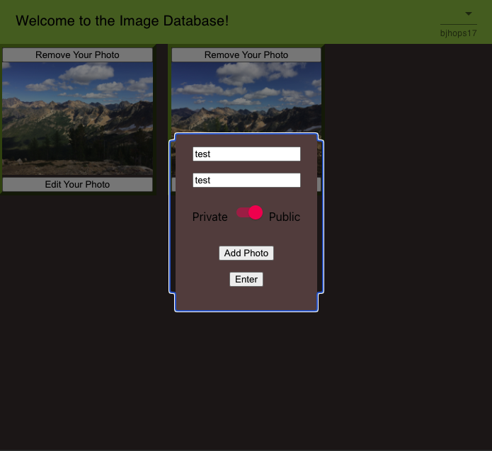
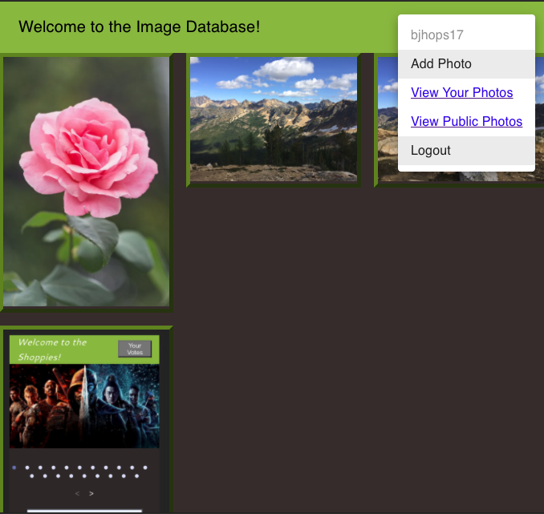
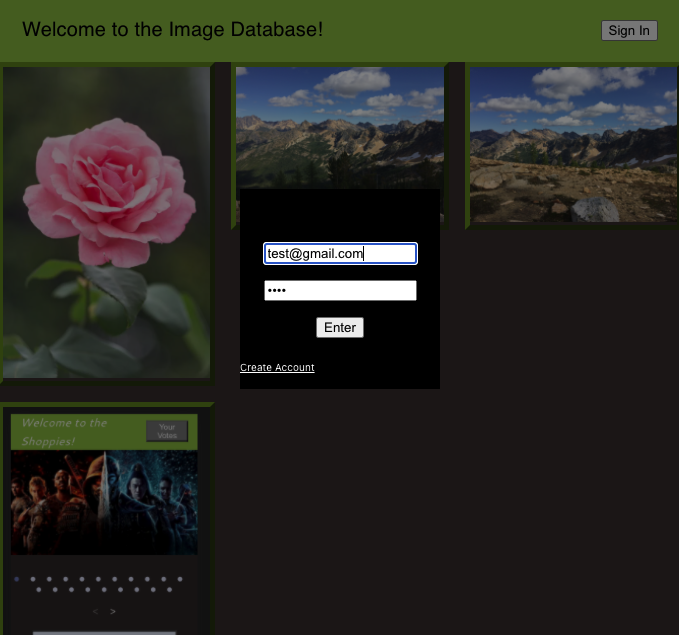

  # Image Database

  

  ## Description

  A full stack application created for the backend shopify internship application. One the backend it is using sequelize with a MySql database. Passwords are encrypted with bcrypt and route authentication is using jsonwebtoken. For the image table, you can post, get, delete, and put. For the user table, you can create an account.

  ## Images

  
  
  

  ## Table of Content

  * [Installation](#installation)

  * [Usage](#usage)

  * [License](#license)

  * [Contributing](#contributors)

  * [Contact](#questions/contact)

  ## Installation

  To Install necessary dependencies, run the following command:
  
  npm install

  ## Usage

    You will be able to see all public photos at homepage but in order to add your own photos you will need to create an account. Once an account is created and you sign in, you will see that the sign in button is replaced with a drop down menu with all available options such as logout, add a photo, edit a photo, view your photos (here you will be able to see all your photos including the ones that you marked as private), and return to home page.
  
  ## Technologies

      bcrypt, cors, jsonwebtoken, express, sequelize, dotenv, node.js, react.js, axios, css, material-ui, and cloudinary.

  ## Contributors

  Ben Hopkins

  ## Questions/Contact

  <a href="https://github.com/bh007183">GitHub Profile</a>
  <a href="mailto:bjhops17@gmail.com"> Email Me</a>
  
  

  